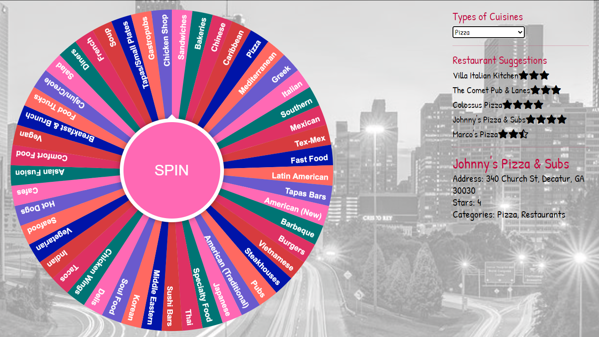

# [ATL-Foodie](https://atl-foodie-page.herokuapp.com): What’s for Dinner Tonight in Atlanta?

### Team Members: Marius Clark, Sharon Colson, Karina Hutula, Marie Prosper

## Table of Contents
1. [Source](#source)
2. [Dataset](#data)
3. [Extract, Transform, and Load](#etl)
4. [Technologies](#tech)
5. [The Website](#site)
6. [Landing Page](#home)
7. [Cuisines](#cuisines)
8. [Ratings](#ratings)
9. [Map](#map)
10. [Fortune](#fortune)
11. [Further Exploration](#future)

### Source
[Yelp! Academic Data Set](https://www.yelp.com/dataset): The dataset was extracted from Yelp! in a .TAR file type in JSON format, which was then unzipped using 7-Zip. The original data set was too large to push to GitHub; therefore, we chose to extract only the data for the Atlanta area and push this portion to Github. The interactive python notebooks which were used to filter, clean, and save the data are available for review on the repository. 

### Dataset
The original datasets were very, very large. In some cases, it was over 10 KB. After it was filtered down to just the restaurants in the Atlanta area, we had a dataset of over 5,000 restaurants.

### Extract, Transform, and Load
The dataset was filtered by Atlanta area zip codes and then by business category to only restaurants. The category portion of the original JSON was presented as an array of arrays therefore it was necessary to filter the data multiple times as we had multiple arrangements for each category. For example: “Pizza, Restaurant” and “Restaurant, Pizza” were presented as two separate categories. Once this issue was resolved, we were able to save the data in both CSV and JSON format and also load the dataset to SQLite for Exploratory Analysis. We created a [database](static/Resources/ipynb/db.sqlite) which contains two separate tables: one for the restaurant data and another to store the different restaurant categories.

### Technologies
* Javascript: D3, Plotly, Leaflet
* JS Plug-Ins: Extra-Markers, Simpleheat
* Framework: Jinja, Flask
* Deployment: Heroku
* Additional: CSS, HTML, Python, Pandas, Bootstrap, SQLite, JSON

## [The Website](https://atl-foodie-page.herokuapp.com)

### [ATL-Foodie Landing Page](https://atl-foodie-page.herokuapp.com)
This page is our “First Impression” page. Designed to give you the flair of Atlanta and easy to use. Each Icon (Cuisines, Ratings, Map, Fortune, and Find) represents a link to a new page. If you get lost and need to go back to the beginning (or if you love it so much you want to see it again), just click the ATL Foodie icon on any page and it will bring you back here. 

### [Cuisines](https://atl-foodie-page.herokuapp.com/cuisines)
Here the data analysis portion of the page begins. This page represents the types of food that Atlanta offers. There are three visualizations on this page. The first represents the count of each cuisine type in a given zip code set, the second represents the top ten cuisine types for the same given zip code set, and the final chart (at the bottom of the page) represents the cuisines for all of Atlanta listed in descending order of how many there are. To add to this data exploration, you may choose any one or combination (up to 10) zip codes from the drop down menu at the top of the page. 

### [Ratings](https://atl-foodie-page.herokuapp.com/ratings)
On this page, you will find a heatmap weighted by average star rating given to a restaurant by Yelp users. The larger and darker areas of the map are areas with higher density and higher values of ratings, whereas the areas on the map that are lighter have lower density and average star ratings. 

### [Map](https://atl-foodie-page.herokuapp.com/map)
The map page is another layer of analysis based on the average star rating for each restaurant. You may view all restaurants at once or individually as the layers of the map are divided by average star rating and the marker layers are individually color coded. If you would like, you can analyze the 5 star restaurants against the one star restaurants and so on. Additionally, if you are in a specific area and looking for a good restaurant to patronize, you can choose a marker and it will give you the restaurant name, rating, address, and categories.

### [Fortune](https://atl-foodie-page.herokuapp.com/fortune)
Here is another fun feature of our analysis… What’s for dinner tonight? How about… Spin the Wheel!!! With this page, you don’t need to have an answer because you can press a button and the wheel will tell you instead! Once you know what type of food you are eating tonight, choose that option from the drop down menu, and you will be provided with a list of 5 suggestions (along with their average ratings) on restaurants of that type. Hover over a suggestion to reveal more information on that restaurant.

### [Further Exploration](https://atl-foodie-page.herokuapp.com/find)
Ok. Ok. We understand that this site is a bird’s eye view of the city, and in order to make it a little friendlier to visitors of the area who might not know exactly where they are, we are working on an expansion. In the Find page, you will have an option to either drop your coordinates or the app can locate you and show you options in the area for a great meal.

Additional Options for Further Exploration:
One thing that we might like to explore in the future is a sentiment analysis of the review texts. The yelp user review dataset was filtered for potential utilization however the dataset filtered down to only Atlanta restaurant reviews was still over 400000 rows and over the Github size allowance. Even a random 10% sample received a warning when making the push. We like the idea of filtering those individual texts and recreating the heatmap based on that analysis to show which areas of Atlanta receive not only the highest staring ratings but the highest textual approvals. It would be interesting to determine which star rating receives the highest number of actual written reviews. 

Also, there was a yelp dataset named tips which consisted of messages such as: “Try the secret chicken sandwich.” Or “Don’t order the pork.” We would love to explore adding these tips to the map markers so that not only can you find a five star Vietnamese restaurant in your area but you can also get a tip on how or what to order for the best experience. 

Contacts:

Sharon Colson:
* https://www.linkedin.com/in/sharon-colson
* sharon.colson@gmail.com

Karina Hutula
* https://www.linkedin.com/in/khutula/
* https://github.com/khutula

Marie Prosper:
* https://marieprosper77.github.io/
* marieprosper77@gmail.com
